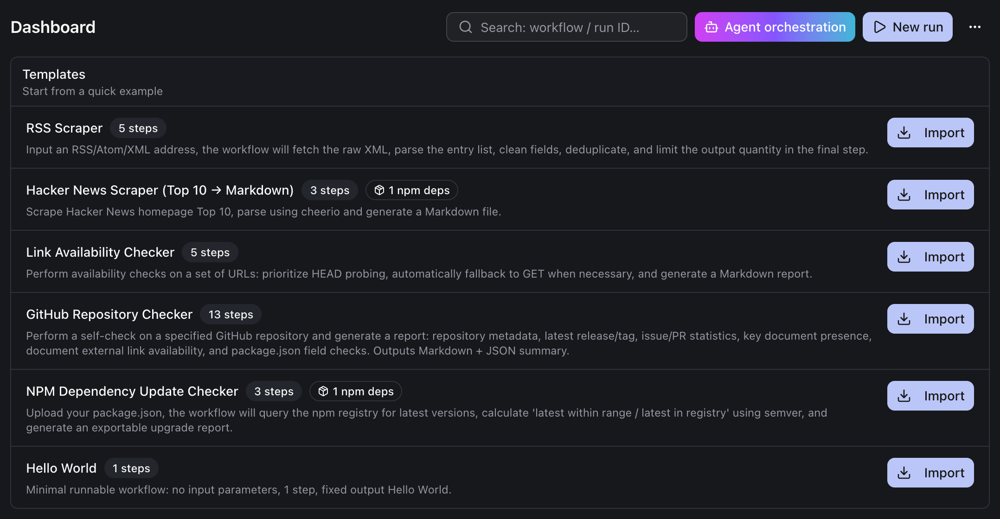
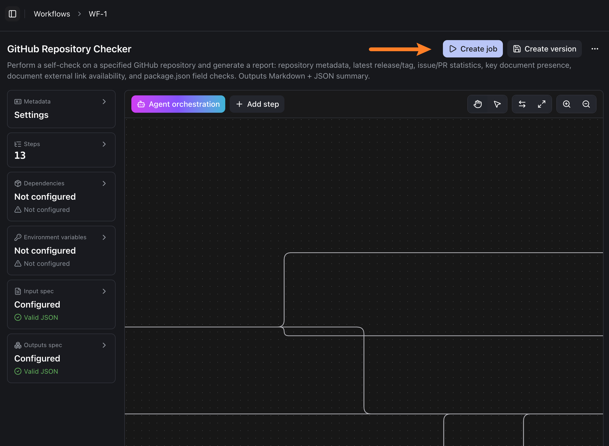
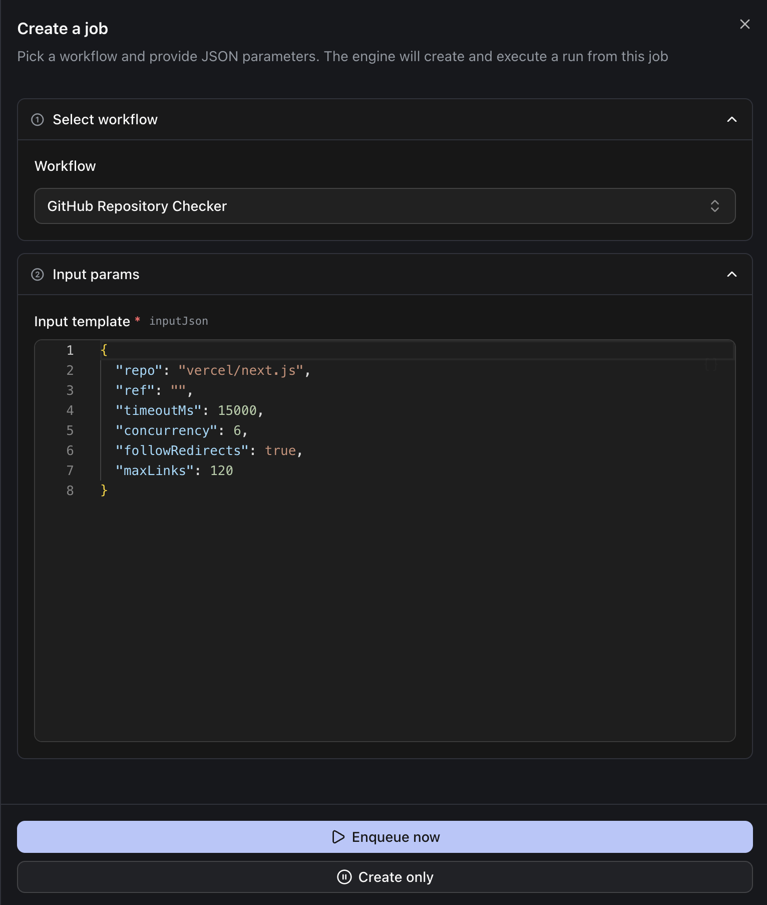
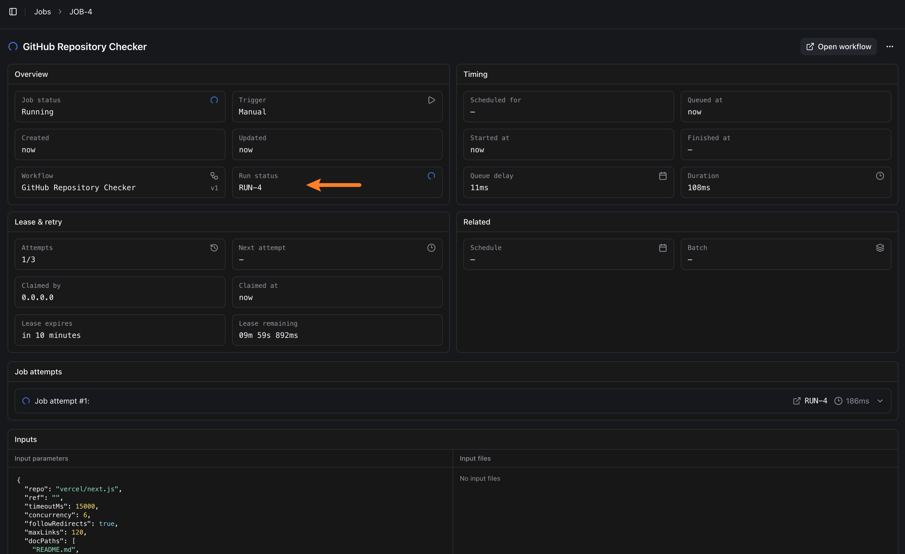
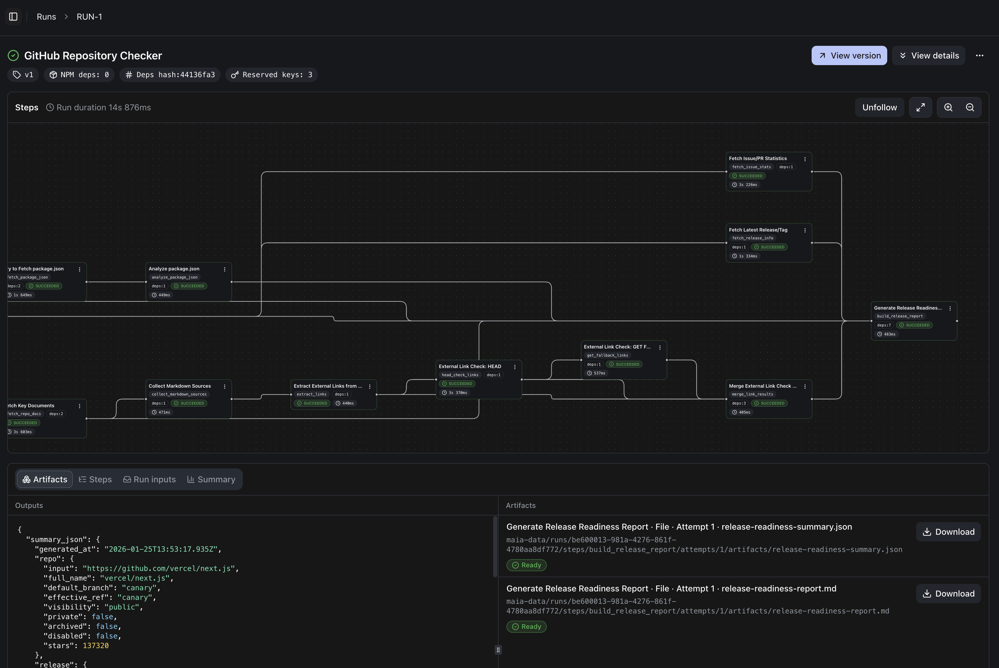
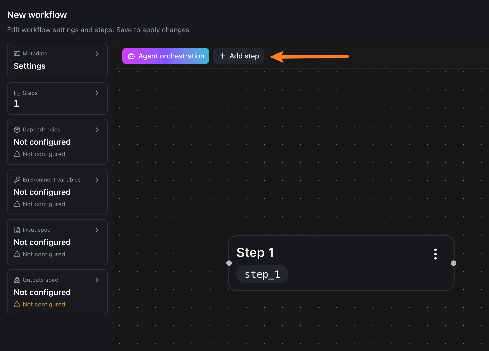
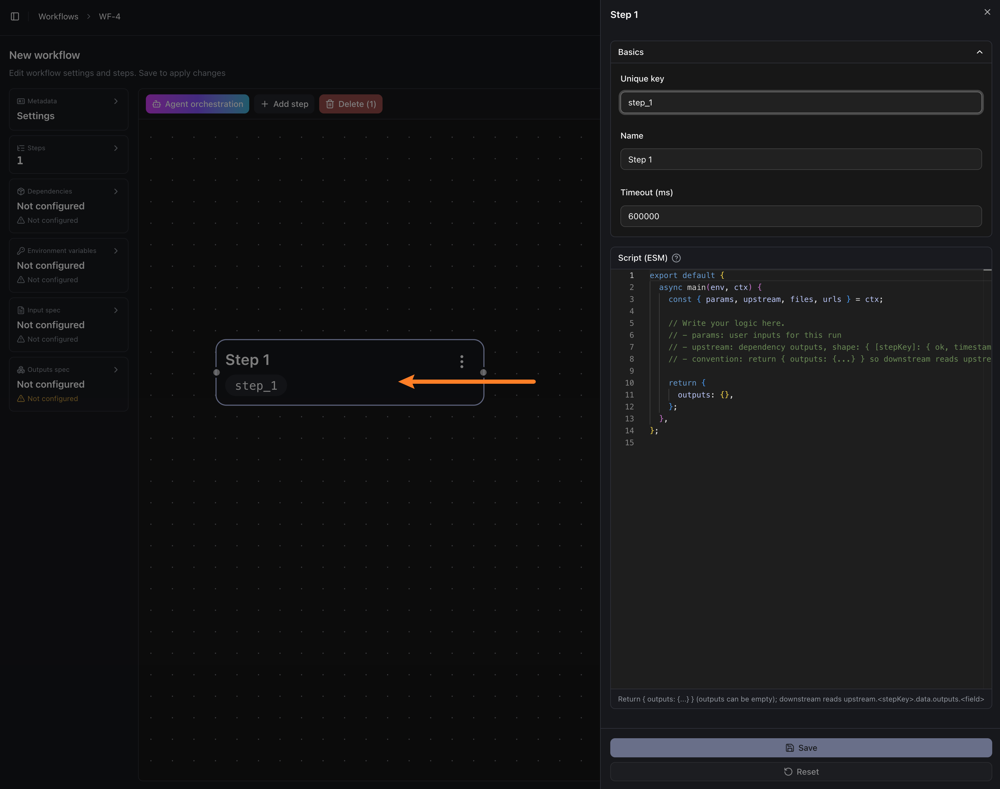

import { Aside, LinkCard ,Steps } from "@astrojs/starlight/components"

We have two goals:

- **Get one successful run first**: import a workflow from a template → create a job → enqueue → inspect logs & artifacts
- **Then build one yourself**: create a new workflow + step → write minimal code → run and verify

Here are a few concepts to align on. You don’t need to fully understand them yet—just follow along and you’ll get a run working:

- **Workflow**: a definition of a set of steps
- **Job**: a reusable configuration created from a workflow
- **Run**: one actual execution of a job. Each enqueue creates a new run.

## Run a template workflow

After completing the initial setup and entering the App, you’ll see some default workflow templates. The goal of this section is: **import any template and successfully produce one run result**.

Pick any template in the template list and click **Import**.



After importing, click **Create job** in the top-right.



On the job creation page, click **Enqueue now** at the bottom.



This creates a run. You’ll typically see a **Run status** card showing whether the run is in progress or finished.



Click the **Run status** card to open the run details page. Here you can:

- **View logs**: confirm the run actually executed. This is the most direct evidence that you “got it working”.
- **View outputs/artifacts**: if the workflow produces artifacts, you’ll get download links here



## Create a new workflow

In this section we’ll build a minimal workflow from scratch. The goal is: **you get a successful run, and `Hello world!` appears in the logs**.

In the left sidebar, select `Workflows`, then click **New** in the top-right. Enter a **workflow name** and **description** (description can be empty), then click **Create**.



#### Edit the code



Select the step you just created to open the editor, paste the code below and save, then click **Create job** in the top-right.

```javascript ins={10}
export default {
  async main(env, ctx) {
    const { params, upstream, files, urls } = ctx;

    // Write your logic here.
    // - params: user inputs for this run
    // - upstream: dependency outputs, shape: { [stepKey]: { ok, timestamp, data } }
    // - convention: return { outputs: {...} } so downstream reads upstream.<stepKey>.data.outputs

    console.log("Hello world!")
    return {
      outputs: {},
    };
  },
};
```

On the job creation page, click **Enqueue now** to create a new run. Open the run details page and search the logs for `Hello world!` to confirm the code executed.

<Aside type="note" title="If you don’t see the run card/logs">
It’s usually because the page hasn’t refreshed yet, or the run is still queued. Wait a few seconds, or go back to the list and re-open the run details page.
</Aside>

