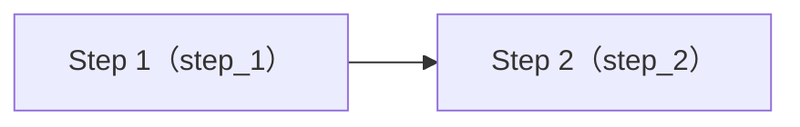
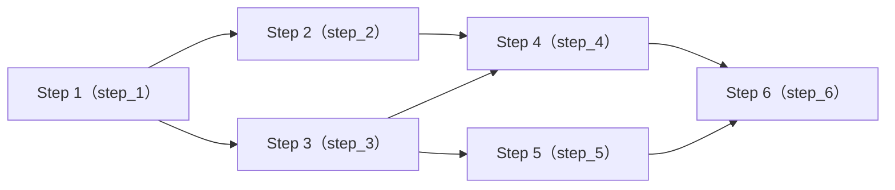

import { Aside, LinkCard, Tabs, TabItem } from "@astrojs/starlight/components"

The workflow editor uses a graph-first design concept to visualize and manage DAGs.

## Editor interface

The editor consists of the following parts:

- **Graph view** - Display step nodes and dependencies
- **Step list** - List all steps and their basic information
- **Code editor** - Edit the script code of the selected step
- **Configuration panel** - Set step key, name, timeout, etc.

## Create and manage steps

### Add step

The `Add step` button in the editor can add steps. Clicking the added step node will enter the step editing mode.

The configurable items are:

- **Step key**： `stepKey`，the stable unique identifier of the step, used for dependency reference and upstream output reading.
- **Name**：The readable name for UI display.
- **Timeout**：Limit the maximum execution time of this step, if it exceeds the timeout, the step will be marked as failed and terminated.
- **Script (ESM)**：The execution logic code of the step.

### Delete step

- Right-click on the step to delete
- Press the backspace key after selecting the step to delete
- Select one or more nodes in the selection mode, and delete in the context menu of the editor

### Disconnect step

- Right-click on the line to disconnect
- Press the backspace key after selecting the line to delete
- Right-click on the step to select the dependency to disconnect

## Edit step script

Each step uses a **ESM JavaScript** to define the execution logic. The engine creates an independent attempt for each execution and provides a unified `main(env, ctx)` entry and context capabilities.

### Script contract

- Must export `main(env, ctx)` (recommended to use the default export object).
- `main()` must return a **JSON serializable** object.
- The return value must contain the `outputs` field, and the `outputs` must be an object (can be an empty object).

A correct example of a minimal structure:

```js
export default {
  async main(env, ctx) {
    return { outputs: {} }
  },
}
```

### Execution model

- **Input**：The engine will write `input.json` to the current attempt and provide the same data view in `ctx.input`.
- **Upstream**：Before the step starts, the engine will read the latest successful output of the dependent step and inject it into `ctx.upstream`.
- **Output**：The return value of `main()` will be written to `output.json`. The `outputs` will be used as the base data source for subsequent steps to read and aggregate the workflow output.

### Context

- **`ctx.params`**：The initial input of this run, from `Run Inputs`
- **`ctx.upstream`**：The upstream step output mapping, structured as `{ ok, timestamp, data }`
- **`ctx.artifacts`**：The registered artifacts, see below
- **`ctx.files`**：The run directory and IO paths (containing `attemptDir`, `inputPath`, `outputPath`)
- **`ctx.run`**：The run metadata `{ runId, stepKey, attemptNo }`
- **`ctx.log / ctx.warn / ctx.error`**：Write to the step log

## Examples

### 1. Read input parameters

<Tabs>
<TabItem label="Step code">
```js {4-6, 14-16}
export default {
  async main(env, ctx) {
    // Read input parameters
    const keyword = String(ctx.params.keyword ?? "").trim()
    const category = String(ctx.params.category ?? "").trim()
    const language = String(ctx.params.language ?? "").trim() || "zh-CN"

    // Validate required parameters
    if (!keyword) throw new Error("Missing param: keyword")
    if (!category) throw new Error("Missing param: category")

    // Read input files
    // The system will automatically merge urlFiles / uploadFiles as fields into ctx.params.files
    const files = Array.isArray(ctx.params.files) ? ctx.params.files : []
    const urlFiles = files.filter((f) => f && typeof f === "object" && f.source === "url")
    const uploadFiles = files.filter((f) => f && typeof f === "object" && f.source === "upload")

    // Validate the number of file inputs
    if (urlFiles.length > 10) throw new Error("Too many urlFiles (max 10)")
    if (uploadFiles.length > 6) throw new Error("Too many uploadFiles (max 6)")

    return {
      outputs: {
        keyword,
        category,
        language,
        urlFilesCount: urlFiles.length,
        uploadFilesCount: uploadFiles.length,
      },
    }
  },
}
```
</TabItem>
<TabItem label="Input specification">

The input specification defines some parameters that the workflow needs to run. For more information about **input specification**, please refer to [input specification](/workflows/input-spec/).

According to the definition, the workflow needs the following parameters to run:

- `keyword` - The keyword
- `category` - The category
- `language` - The language (optional)
- `urlFiles` - The URL files (maximum 10)
- `uploadFiles` - The uploaded files (maximum 6)

```json {7-9, 14-15}
{
  "version": 2,
  "paramsSchema": {
    "type": "object",
    "additionalProperties": false,
    "properties": {
      "keyword": { "type": "string", "title": "Keyword" },
      "category": { "type": "string", "title": "Category" },
      "language": { "type": "string", "title": "Language", "default": "zh-CN" }
    },
    "required": ["keyword", "category"]
  },
  "filesInput": {
    "urlFiles": { "title": "URL files", "enabled": true, "maxItems": 10 },
    "uploadFiles": { "title": "Uploaded files", "enabled": true, "maxItems": 6 }
  }
}
```
</TabItem>
<TabItem label="Input template">

The input template format is generated according to the definition of the input specification, used to provide guidance when creating a task.

```json
{
  "params": {
    "keyword": "maia",
    "category": "docs",
  },
  "urlFiles": [{ "url": "https://example.com/spec.pdf" }],
  "uploadNotes": "Upload 1 file: local.pdf"
}
```
</TabItem>
</Tabs>

### 2. Read upstream step parameters and pass all parameters to downstream steps

There is a workflow with only two steps:



**Step 1** is the upstream, **Step 2** is the downstream of step 1.

<Tabs>
<TabItem label="Step 1">
```js {4-6, 12}
export default {
  async main(env, ctx) {
    // Read input parameters
    const keyword = String(ctx.params.keyword ?? "").trim()
    const category = String(ctx.params.category ?? "").trim()
    const language = String(ctx.params.language ?? "").trim() || "zh-CN"
    if (!keyword) throw new Error("Missing param: keyword")
    if (!category) throw new Error("Missing param: category")

    // Output：Pass all input parameters of this step (including the files field merged by the system)
    // to allow downstream or output specification to reference by field
    return { outputs: { ...ctx.params, keyword, category, language } }
  },
}
```
</TabItem>
<TabItem label="Step 2">
```js {4,7}
export default {
  async main(env, ctx) {
    // Read the result of the upstream step
    const up = ctx.upstream?.step_1
    
    // You can also use bracket notation to read the value
    // const up = ctx.upstream?.["step_1"]
    
    if (!up?.ok) throw new Error("Missing upstream output: step_1")
    const outputs = up.data?.outputs ?? null
    if (!outputs) throw new Error("Missing upstream outputs: step_1")

    // Output：Pass all upstream outputs
    return { outputs: { ...outputs } }
  },
}
```
</TabItem>
</Tabs>

When reading the upstream step output using `ctx.upstream?.<stepKey>` or `ctx.upstream?.["<stepKey>"]`, you can use bracket notation or dot notation to read the value.

### 3. Read upstream step parameters and pass some parameters to downstream steps

There is a workflow with the following structure:



This example is used to demonstrate: the upstream writes the necessary fields to `outputs`, and the downstream reads and continues to pass by field using `ctx.upstream.<stepKey>.data.outputs.<field>`.

<Tabs>
<TabItem label="Step 1">

Input entry: read `ctx.params`, output `keyword / limit`, for downstream selective reference.

```js
export default {
  async main(env, ctx) {
    const keyword = String(ctx.params.keyword ?? "").trim()
    const limit = Number(ctx.params.limit ?? 10)
    if (!keyword) throw new Error("Missing param: keyword")
    if (!Number.isFinite(limit) || limit <= 0) throw new Error("Invalid param: limit")

    return { outputs: { keyword, limit } }
  },
}
```

</TabItem>
<TabItem label="Step 2">

Field pass: read `step_1.outputs.keyword`, output the normalized `keywordNormalized`.

```js
export default {
  async main(env, ctx) {
    const keyword = ctx.upstream.step_1?.data?.outputs?.keyword
    if (!keyword) throw new Error("Missing upstream field: step_1.outputs.keyword")

    return { outputs: { keywordNormalized: String(keyword).toLowerCase() } }
  },
}
```

</TabItem>
<TabItem label="Step 3">

Field pass: read `step_1.outputs.limit`, output the derived field `pageSize`.

```js
export default {
  async main(env, ctx) {
    const limit = ctx.upstream.step_1?.data?.outputs?.limit
    if (typeof limit !== "number") throw new Error("Missing upstream field: step_1.outputs.limit")

    const pageSize = Math.min(Math.max(1, limit), 50)
    return { outputs: { pageSize } }
  },
}
```

</TabItem>
<TabItem label="Step 4">

Aggregation: read `step_2.outputs.keywordNormalized` and `step_3.outputs.pageSize` at the same time, output the combined result.

```js
export default {
  async main(env, ctx) {
    const keyword = ctx.upstream.step_2?.data?.outputs?.keywordNormalized
    const pageSize = ctx.upstream.step_3?.data?.outputs?.pageSize
    if (!keyword) throw new Error("Missing upstream field: step_2.outputs.keywordNormalized")
    if (typeof pageSize !== "number") throw new Error("Missing upstream field: step_3.outputs.pageSize")

    return { outputs: { keyword, pageSize } }
  },
}
```

</TabItem>
<TabItem label="Step 5">

Bypass output: read `step_3.outputs.pageSize`, output the reusable hint information `hint`.

```js
export default {
  async main(env, ctx) {
    const pageSize = ctx.upstream.step_3?.data?.outputs?.pageSize
    if (typeof pageSize !== "number") throw new Error("Missing upstream field: step_3.outputs.pageSize")

    return { outputs: { hint: `pageSize=${pageSize}` } }
  },
}
```

</TabItem>
<TabItem label="Step 6">

Final aggregation: read the specified fields of `step_4` and `step_5`, form the final `outputs`.

```js
export default {
  async main(env, ctx) {
    const keyword = ctx.upstream.step_4?.data?.outputs?.keyword
    const pageSize = ctx.upstream.step_4?.data?.outputs?.pageSize
    const hint = ctx.upstream.step_5?.data?.outputs?.hint
    if (!keyword) throw new Error("Missing upstream field: step_4.outputs.keyword")
    if (typeof pageSize !== "number") throw new Error("Missing upstream field: step_4.outputs.pageSize")
    if (!hint) throw new Error("Missing upstream field: step_5.outputs.hint")

    return { outputs: { keyword, pageSize, hint } }
  },
}
```

</TabItem>
</Tabs>

In this example, the downstream does not depend on "whole package pass-through", but combines and passes by field, making it easier to stabilize the connection and output specification to reference by field.

## Output artifacts

Artifacts will be displayed and downloaded in the **Artifacts** panel of the run details.

### Output text artifacts

Use `ctx.artifacts.writeText(name, text, { kind?, summary? })` to write the UTF-8 text file to the current attempt's `artifacts/` directory and register it as an artifact.

```js {4}
export default {
  async main(env, ctx) {
    const report = `# Report\nrunId=${ctx.run.runId}\nstep=${ctx.run.stepKey}\n`
    await ctx.artifacts.writeText("report.md", report, { kind: "file", summary: "Markdown report" })
    return { outputs: { ok: true } }
  },
}
```

### Output binary artifacts

Use `ctx.artifacts.writeBytes(name, bytes, { kind?, summary?, encoding? })` to write the binary file to the current attempt's `artifacts/` directory and register it as an artifact.

`bytes` supports `Buffer | Uint8Array | ArrayBuffer | string`; when `bytes` is a string, `encoding` defaults to `"base64"` (or specified `"utf8"`).

```js {4}
export default {
  async main(env, ctx) {
    const pngBase64 = String(ctx.params.pngBase64 ?? "")
    await ctx.artifacts.writeBytes("image.png", pngBase64, { encoding: "base64", summary: "PNG" })
    return { outputs: { hasImage: true } }
  },
}
```

### Register file as artifact

Use `ctx.artifacts.registerFile(absPath, { kind?, name?, summary? })` to register the existing file as an artifact.

Due to security restrictions, only files in the current attempt directory are accepted.

```js {9}
import path from "node:path"
import fs from "node:fs/promises"

export default {
  async main(env, ctx) {
    const p = path.join(ctx.files.dirs.attemptDir, "artifacts", "raw.json")
    await fs.mkdir(path.dirname(p), { recursive: true })
    await fs.writeFile(p, JSON.stringify({ ts: Date.now() }, null, 2), "utf8")
    await ctx.artifacts.registerFile(p, { summary: "Raw payload" })
    return { outputs: { rawPath: p } }
  },
}
```

## Input and output

Input and output are the core concepts of the workflow. Input is used to define what parameters the workflow needs, and output is used to define what results the workflow needs to output.

<LinkCard
  title="Input specification"
  href="/workflows/input-spec/"
  description="The input specification defines what parameters the workflow needs to run."
/>
<LinkCard
  title="Output specification"
  href="/workflows/outputs-spec/"
  description="The output specification defines what results the workflow needs to output."
/>


## Shortcuts

| Shortcut | Function |
|------|------|
| `Q` | Switch to horizontal layout |
| `W` | Switch to vertical layout |
| `E` | Switch to custom layout |
| `V` | Pan mode |
| `S` | Selection mode |
| `⌘ + A`, `Ctrl + A` | Select all steps |