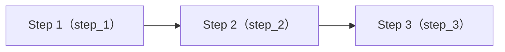

import { Aside, Tabs, TabItem } from "@astrojs/starlight/components"

The output spec allows you to map the output of a **specific step** to the **stable output** published by the workflow.

## Output spec structure

The output spec uses JSON format to define:

```json
{
  "version": 1,         /* The version number is currently fixed to 1 */
  "outputs": {
    "summary": {        /* The output name for external use */
      "stepKey": "summarize",
      "field": "text",  /* Optional: only take outputs.text */
      "title": "Summary",
      "description": "Summary text for display"
    }
  }
}
```

### `version`

The current version number, fixed to `1`.

### `outputs`

Output mapping table: the key is the **output name for external use**, and the value is the mapping configuration object.

Each output supports the following fields:

- `stepKey` - The source step key (required)
- `field` - Only take a field from the step output (optional)
- `title` - UI display title (optional)
- `description` - UI description (optional)

## Mapping rules

### Output source

The output spec reads the `outputs` in the return value of the step `main(env, ctx)`:

```javascript
return { outputs: { text: "hello", wordCount: 5 } };
```

### Set `field`

The output value is the entire `outputs` object of the step.

### Unset `field`

The output value is the entire `outputs[field]` object of the step.

<Aside type="note" title="When is null">
If the source step did not execute successfully, or the field pointed to by `field` does not exist, the corresponding output value is `null`. The output spec itself will not be invalidated.
</Aside>

## Examples

There is a workflow with the following structure:



Step scripts:

<Tabs>
<TabItem label="Step 1">
```js
export default {
  async main(env, ctx) {
    return {
      outputs: {
        items: ["a", "b", "c"],
        count: 3,
        source: "demo",
      },
    }
  },
}
```
</TabItem>
<TabItem label="Step 2">
```js
export default {
  async main(env, ctx) {
    const s1 = ctx.upstream["step_1"]?.data?.outputs ?? null
    if (!s1) throw new Error("Missing upstream outputs: step_1")

    return {
      outputs: {
        itemsUpper: (s1.items ?? []).map((x) => String(x).toUpperCase()),
        count: Number(s1.count ?? 0),
        summary: `count=${Number(s1.count ?? 0)}`,
      },
    }
  },
}
```
</TabItem>
<TabItem label="Step 3">
```js
export default {
  async main(env, ctx) {
    const s2 = ctx.upstream["step_2"]?.data?.outputs ?? null
    if (!s2) throw new Error("Missing upstream outputs: step_2")

    return {
      outputs: {
        status: "ok",
        text: `items=${JSON.stringify(s2.itemsUpper ?? [])}`,
        itemCount: Number(s2.count ?? 0),
      },
    }
  },
}
```
</TabItem>
</Tabs>

### 1. Output all properties of all steps

```json
{
  "version": 1,
  "outputs": {
    "step1": { "stepKey": "step_1" },
    "step2": { "stepKey": "step_2" },
    "step3": { "stepKey": "step_3" }
  }
}
```

### 2. Output all properties of step 1 and 2 + some properties of step 3

```json
{
  "version": 1,
  "outputs": {
    "step1": { "stepKey": "step_1" },
    "step2": { "stepKey": "step_2" },
    "status": { "stepKey": "step_3", "field": "status" },
    "text": { "stepKey": "step_3", "field": "text" }
  }
}
```

### 3. Output some properties of step 1, 2 and 3

```json
{
  "version": 1,
  "outputs": {
    "items": { "stepKey": "step_1", "field": "items" },
    "count": { "stepKey": "step_1", "field": "count" },
    "summary": { "stepKey": "step_2", "field": "summary" },
    "status": { "stepKey": "step_3", "field": "status" },
    "itemCount": { "stepKey": "step_3", "field": "itemCount" }
  }
}
```

<Aside type="note" title="Note">
When aggregating, the latest successful output of the source step will be read; when the step does not execute successfully or the field does not exist, the corresponding output value is `null`.
</Aside>
