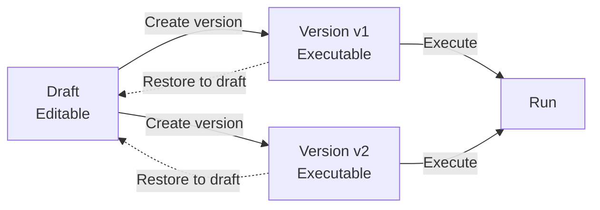

import { Aside } from "@astrojs/starlight/components"

A version is an **immutable copy** of the workflow, which will be used when running. Restore is to cover the content of a version back to the draft, to restore to a known stable state.

- **Draft**：The editable state of the workflow (code, dependencies, environment variables, input/output specifications).
- **Version**：The result of a release (cannot be modified, can be used for execution).
- **Restore**：Restore a version to the draft, for continued editing.

## Create version

There are two ways to create a version:

- **Manual creation**：Click the `Create version` button in the top right corner of the workflow details page to create.
- **Semi-automatic creation**：When creating a new task, new/edit schedule, or new batch, if the draft is selected, the system will automatically create a new version based on the draft.

## Version guarantees

The same version will be consistent when executed:

- **Step code**
- **Dependencies**
- **Environment variables**
- **Input specifications and output specifications**

<Aside type="tip" title="Understanding">
A version is used to harden the **complete configuration used for this execution**. Modifications to the draft will not affect the created version.
</Aside>

## Unguaranteed items

A version guarantees that the **workflow configuration remains unchanged**, but cannot guarantee that the external environment remains unchanged, such as:

- External API returns
- Network and timeout
- Time, random number
- Concurrency and resource fluctuations

## Restore to draft

Restore is used for the following scenarios: to restore the draft to a stable version; or to continue development from a historical version.

1. Select a version in the version list
2. Click "Restore to draft"
3. The draft will be completely covered by the version

<Aside type="caution" title="Will cover the draft">
Restore will cover the current draft. If you need to keep the changes in the draft, it is recommended to create a version first and then restore.
</Aside>

## Example

After adjusting the dependencies and environment variables in the draft and verifying them, create `v3`. If there is a problem online, you can switch the execution back to `v2`, and restore `v2` to the draft for repair; after the repair is completed, create `v4`. This process can achieve execution and development without affecting each other.
