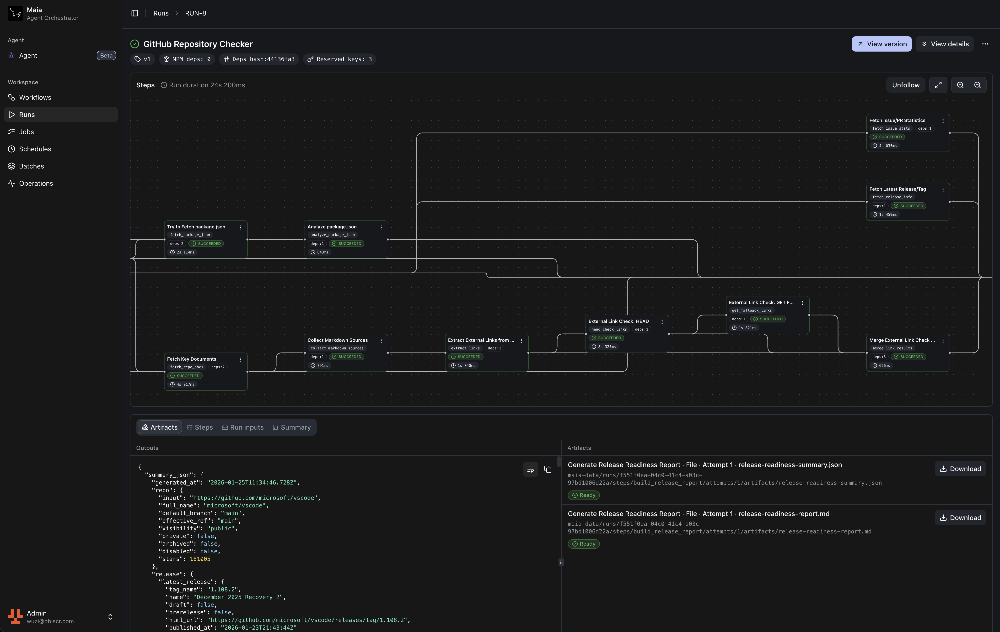

import { LinkCard } from "@astrojs/starlight/components"

Maia 是一个自托管的工作流编排与执行平台，采用 `DAG` 结构，面向长时间运行的自动化任务。

## 核心能力

- **持久化**：状态、输入、输出、日志与产物可长期保留。
- **可观测**：通过 `SSE` 推送实时日志与事件；支持查看每步的输入、输出与产物。
- **可回放**：执行完成后可回放执行过程。
- **隔离执行**：可选启用 Runner 执行（生产推荐）；未启用时由 App 本地执行。
- **可组合**：明确的步骤依赖；上游输出按 stepKey 传递给下游；支持输入与输出规范。

## 适用场景

- **数据处理流水线**：抓取、清洗、转换与聚合；失败后可从断点恢复。
- **定时任务**：备份、巡检、报表生成与分发；需要稳定的调度与可追溯记录。
- **API 编排**：多 API 调用与聚合；需要可视化流程与可调试记录。
- **批量处理**：批量文件或记录处理；需要并发控制与进度可视化。

## 快速开始

<LinkCard 
  title="快速部署" 
  description="使用 Docker Compose 快速部署 Maia" 
  href="/zh-cn/quick-start/self-host/" 
/>

<LinkCard 
  title="第一个工作流" 
  description="创建并运行第一个工作流" 
  href="/zh-cn/quick-start/first-workflow/" 
/>

## 相关主题

- 调试与回放：`Run`、`RunStep`、`Attempt`
- 输入规范：`inputSpec`
- 输出规范：`outputsSpec`