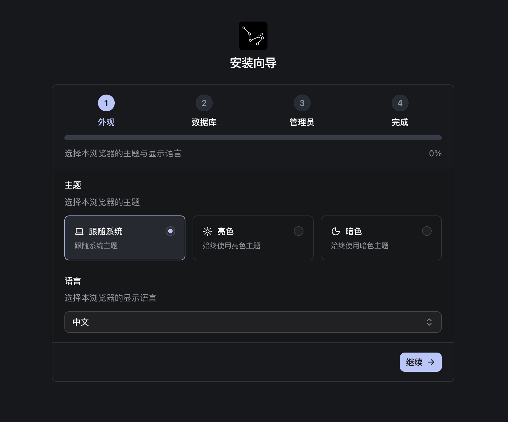
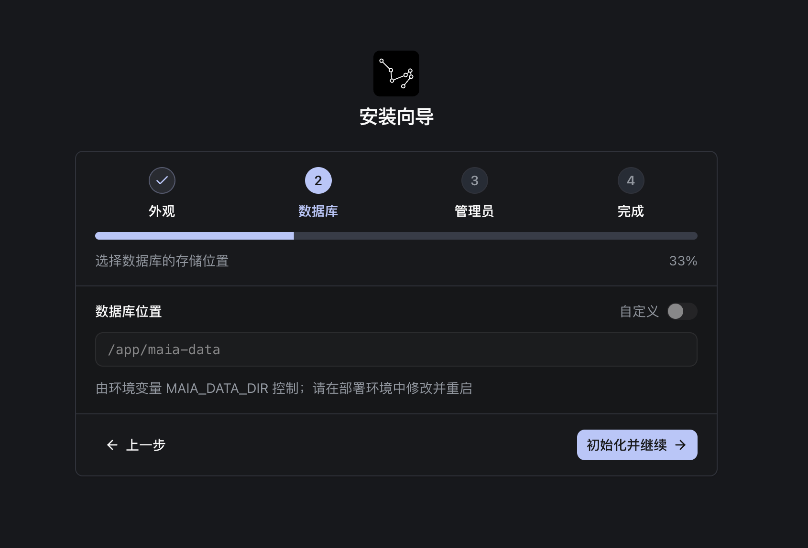
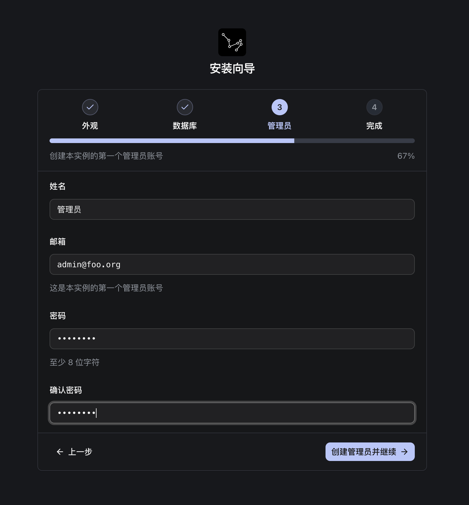

import { Aside, LinkCard ,Steps } from "@astrojs/starlight/components"

首次启动 Maia 时，打开 `http://localhost:3690` 会进入初始化向导。你也可以直接访问路径 `/setup`。

这个向导的目标是：**把 Maia 的基础配置写入数据目录，并创建第一个管理员账号**。

向导包含 4 步：外观 → 数据目录/数据库 → 管理员 → 完成。

<LinkCard title="打开初始化向导" description="首次启动：打开 http://localhost:3690（或 /setup）进入初始化设置。" href="http://localhost:3690" target="_blank"/>

## 外观设置

选择你喜欢的主题和语言。这一步只影响界面显示，不影响后续运行。

- **主题**：跟随系统 / 浅色 / 深色。
- **语言**：English / 中文（简体）。

## 数据库设置

<Aside type="note" title="提示">
数据库默认的路径是 `/app/maia-data`。如果你希望使用自定义数据目录，请在环境变量中设置 `MAIA_DATA_DIR`。并重启 Docker 容器。
</Aside>

Maia 默认使用 **SQLite**。这一页实际是在选择 `实例数据目录` — 数据库文件、配置、以及运行数据都会存放在这里。你可以把它理解成 Maia 的“工作目录”。

- **数据库文件**：`<数据目录>/db.sqlite`
- **实例配置文件**：`<数据目录>/settings/instance.json`。向导会把你选择的路径写入这个文件。

当你完成这一步并继续下一页时，通常表示：

- 数据目录可写
- Maia 能在该目录下创建/读取 SQLite 数据库文件

## 管理员账号

创建第一个管理员账号。创建成功后会自动登录：

- **姓名**：必填
- **邮箱**：必填，且必须是合法邮箱格式
- **密码**：至少 8 位，最多 256 位
- **确认密码**：必须与密码一致

<Aside type="note" title="注册默认关闭">
完成初始化后，系统会默认把注册模式设置为 **DISABLED**（关闭公开注册）。你可以在后续的 **偏好设置 → 系统** 里再调整注册策略。
</Aside>

## 完成

点击 **进入应用** 即可跳转到 Maia 首页开始使用。
