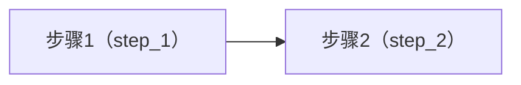
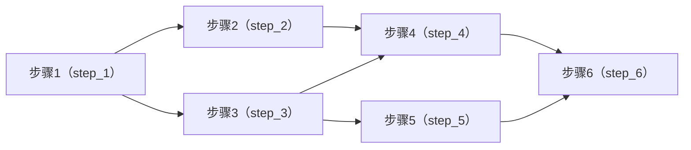

import { Aside, LinkCard, Tabs, TabItem } from "@astrojs/starlight/components"

工作流编辑器采用图优先的设计理念，以可视化的方式构建和管理 DAG。

## 编辑器界面

编辑器由以下部分组成：

- **图视图** - 显示步骤节点和依赖关系
- **步骤列表** - 列出所有步骤及其基本信息
- **代码编辑区** - 编辑选中步骤的脚本代码
- **配置面板** - 设置步骤的 key、名称、超时等属性

## 创建和管理步骤

### 添加步骤

在编辑器上方的 `添加步骤` 按钮可以添加步骤。点击添加的步骤节点即可进入步骤的编辑模式。

可配置项有：

- **步骤标识**： `stepKey`，步骤的稳定唯一标识，用于依赖引用与上游输出读取。
- **名称**：用于 UI 展示的可读名称。
- **超时**：限制该步骤单次执行的最长时间，超时会终止执行并将该步骤标记为失败。
- **脚本（ESM）**：步骤的执行逻辑代码。

### 删除步骤

- 在步骤右键选择删除
- 选中步骤后按下退格键删除
- 在选择模式选中一个或多个节点，在编辑器的上下文菜单删除

### 断开步骤

- 在连线右键断开连接
- 选中连线后按下退格键删除
- 在步骤右键选择依赖断开连接

## 编辑步骤脚本

每个步骤使用一段 **ESM JavaScript** 定义执行逻辑。引擎在运行时为每次执行创建独立的 attempt，并提供统一的 `main(env, ctx)` 入口与上下文能力。

### 脚本契约

- 必须导出 `main(env, ctx)`（推荐使用默认导出对象）。
- `main()` 必须返回一个 **可 JSON 序列化** 的对象。
- 返回值必须包含 `outputs` 字段，且 `outputs` 必须是对象（可为空对象）。

一个最小结构的正确示例：

```js
export default {
  async main(env, ctx) {
    return { outputs: {} }
  },
}
```

### 运行模型

- **输入**：引擎会为当前 attempt 写入 `input.json`，并在 `ctx.input` 中提供同一份数据视图。
- **上游**：在步骤开始前，引擎会读取依赖步骤的最新成功输出，并注入到 `ctx.upstream`。
- **输出**：`main()` 的返回值会被写入 `output.json`。其中 `outputs` 会作为后续步骤读取、以及工作流输出聚合的基础数据源。

### 上下文

- **`ctx.params`**：本次运行的初始输入，来自 `运行输入`
- **`ctx.upstream`**：上游步骤输出映射，结构为 `{ ok, timestamp, data }`
- **`ctx.artifacts`**：注册产物，见下节
- **`ctx.files`**：运行目录与 IO 路径（包含 `attemptDir`、`inputPath`、`outputPath`）
- **`ctx.run`**：运行元信息 `{ runId, stepKey, attemptNo }`
- **`ctx.log / ctx.warn / ctx.error`**：写入步骤日志

## 示例

### 1. 读取输入参数

<Tabs>
<TabItem label="步骤代码">
```js {4-6, 14-16}
export default {
  async main(env, ctx) {
    // 读取输入参数
    const keyword = String(ctx.params.keyword ?? "").trim()
    const category = String(ctx.params.category ?? "").trim()
    const language = String(ctx.params.language ?? "").trim() || "zh-CN"

    // 校验必填参数
    if (!keyword) throw new Error("Missing param: keyword")
    if (!category) throw new Error("Missing param: category")

    // 读取输入文件
    // 系统会自动将 urlFiles / uploadFiles 作为字段合并到 ctx.params.files
    const files = Array.isArray(ctx.params.files) ? ctx.params.files : []
    const urlFiles = files.filter((f) => f && typeof f === "object" && f.source === "url")
    const uploadFiles = files.filter((f) => f && typeof f === "object" && f.source === "upload")

    // 校验文件输入数量
    if (urlFiles.length > 10) throw new Error("Too many urlFiles (max 10)")
    if (uploadFiles.length > 6) throw new Error("Too many uploadFiles (max 6)")

    return {
      outputs: {
        keyword,
        category,
        language,
        urlFilesCount: urlFiles.length,
        uploadFilesCount: uploadFiles.length,
      },
    }
  },
}
```
</TabItem>
<TabItem label="输入规范">

输入规范定义了运行工作流需要的一些参数。更多关于**输入规范**，请参考[输入规范](/zh-cn/workflows/input-spec/)。

根据定义，运行该工作流一共需要如下参数：

- `keyword` - 关键词
- `category` - 分类
- `language` - 语言（可选）
- `urlFiles` - URL 文件（最多10个）
- `uploadFiles` - 上传文件（最多6个）

```json {7-9, 14-15}
{
  "version": 2,
  "paramsSchema": {
    "type": "object",
    "additionalProperties": false,
    "properties": {
      "keyword": { "type": "string", "title": "关键词" },
      "category": { "type": "string", "title": "分类" },
      "language": { "type": "string", "title": "语言", "default": "zh-CN" }
    },
    "required": ["keyword", "category"]
  },
  "filesInput": {
    "urlFiles": { "title": "URL 文件", "enabled": true, "maxItems": 10 },
    "uploadFiles": { "title": "上传文件", "enabled": true, "maxItems": 6 }
  }
}
```
</TabItem>
<TabItem label="输入模板">

输入模板格式是根据输入规范的定义生成的，用于在创建任务时提供引导填写。

```json
{
  "params": {
    "keyword": "maia",
    "category": "docs",
  },
  "urlFiles": [{ "url": "https://example.com/spec.pdf" }],
  "uploadNotes": "上传 1 个文件：local.pdf"
}
```
</TabItem>
</Tabs>

### 2. 读取上游步骤参数并全部透传到下游步骤

有这样一个工作流，只有两个步骤：



**步骤1**是上游，**步骤2**是步骤1的下游。

<Tabs>
<TabItem label="步骤 1">
```js {4-6, 12}
export default {
  async main(env, ctx) {
    // 读取输入参数
    const keyword = String(ctx.params.keyword ?? "").trim()
    const category = String(ctx.params.category ?? "").trim()
    const language = String(ctx.params.language ?? "").trim() || "zh-CN"
    if (!keyword) throw new Error("Missing param: keyword")
    if (!category) throw new Error("Missing param: category")

    // 输出：透传本步骤全部输入参数（包含系统合并的 files 字段）
    // 便于下游或输出规范按字段引用
    return { outputs: { ...ctx.params, keyword, category, language } }
  },
}
```
</TabItem>
<TabItem label="步骤 2">
```js {4,7}
export default {
  async main(env, ctx) {
    // 读取上游步骤的结果
    const up = ctx.upstream?.step_1
    
    // 也可以使用括号取值
    // const up = ctx.upstream?.["step_1"]
    
    if (!up?.ok) throw new Error("Missing upstream output: step_1")
    const outputs = up.data?.outputs ?? null
    if (!outputs) throw new Error("Missing upstream outputs: step_1")

    // 输出：完整透传上游 outputs
    return { outputs: { ...outputs } }
  },
}
```
</TabItem>
</Tabs>

使用 `ctx.upstream?.<stepKey>` 或者 `ctx.upstream?.["<stepKey>"]` 读取上游步骤输出时，支持使用括号取值或点号取值。

### 3. 读取上游步骤参数并传递部分参数到下游步骤

有这样一个工作流，结构如下：



该案例用于演示：上游将必要字段写入 `outputs`，下游通过 `ctx.upstream.<stepKey>.data.outputs.<field>` 按字段读取并继续透传。

<Tabs>
<TabItem label="步骤 1">

输入入口：读取 `ctx.params`，输出 `keyword / limit`，供下游选择性引用。

```js
export default {
  async main(env, ctx) {
    const keyword = String(ctx.params.keyword ?? "").trim()
    const limit = Number(ctx.params.limit ?? 10)
    if (!keyword) throw new Error("Missing param: keyword")
    if (!Number.isFinite(limit) || limit <= 0) throw new Error("Invalid param: limit")

    return { outputs: { keyword, limit } }
  },
}
```

</TabItem>
<TabItem label="步骤 2">

字段透传：读取 `step_1.outputs.keyword`，输出规范化后的 `keywordNormalized`。

```js
export default {
  async main(env, ctx) {
    const keyword = ctx.upstream.step_1?.data?.outputs?.keyword
    if (!keyword) throw new Error("Missing upstream field: step_1.outputs.keyword")

    return { outputs: { keywordNormalized: String(keyword).toLowerCase() } }
  },
}
```

</TabItem>
<TabItem label="步骤 3">

字段透传：读取 `step_1.outputs.limit`，输出派生字段 `pageSize`。

```js
export default {
  async main(env, ctx) {
    const limit = ctx.upstream.step_1?.data?.outputs?.limit
    if (typeof limit !== "number") throw new Error("Missing upstream field: step_1.outputs.limit")

    const pageSize = Math.min(Math.max(1, limit), 50)
    return { outputs: { pageSize } }
  },
}
```

</TabItem>
<TabItem label="步骤 4">

汇聚：同时读取 `step_2.outputs.keywordNormalized` 与 `step_3.outputs.pageSize`，输出组合结果。

```js
export default {
  async main(env, ctx) {
    const keyword = ctx.upstream.step_2?.data?.outputs?.keywordNormalized
    const pageSize = ctx.upstream.step_3?.data?.outputs?.pageSize
    if (!keyword) throw new Error("Missing upstream field: step_2.outputs.keywordNormalized")
    if (typeof pageSize !== "number") throw new Error("Missing upstream field: step_3.outputs.pageSize")

    return { outputs: { keyword, pageSize } }
  },
}
```

</TabItem>
<TabItem label="步骤 5">

旁路产出：读取 `step_3.outputs.pageSize`，输出可复用的提示信息 `hint`。

```js
export default {
  async main(env, ctx) {
    const pageSize = ctx.upstream.step_3?.data?.outputs?.pageSize
    if (typeof pageSize !== "number") throw new Error("Missing upstream field: step_3.outputs.pageSize")

    return { outputs: { hint: `pageSize=${pageSize}` } }
  },
}
```

</TabItem>
<TabItem label="步骤 6">

最终汇聚：读取 `step_4` 与 `step_5` 的指定字段，形成最终 `outputs`。

```js
export default {
  async main(env, ctx) {
    const keyword = ctx.upstream.step_4?.data?.outputs?.keyword
    const pageSize = ctx.upstream.step_4?.data?.outputs?.pageSize
    const hint = ctx.upstream.step_5?.data?.outputs?.hint
    if (!keyword) throw new Error("Missing upstream field: step_4.outputs.keyword")
    if (typeof pageSize !== "number") throw new Error("Missing upstream field: step_4.outputs.pageSize")
    if (!hint) throw new Error("Missing upstream field: step_5.outputs.hint")

    return { outputs: { keyword, pageSize, hint } }
  },
}
```

</TabItem>
</Tabs>

该案例中，下游不依赖“整包透传”，而是以字段为单位进行组合与传递，便于稳定对接与输出规范按字段引用。

## 输出产物

产物用于沉淀可下载、可回溯的结果文件（报告、截图、原始响应、生成内容等）。产物会在运行详情的**产物**面板中展示与下载。

### 输出文本产物

使用 `ctx.artifacts.writeText(name, text, { kind?, summary? })` 写入 UTF-8 文本文件到当前 attempt 的 `artifacts/` 目录，并注册为产物。

```js {4}
export default {
  async main(env, ctx) {
    const report = `# Report\nrunId=${ctx.run.runId}\nstep=${ctx.run.stepKey}\n`
    await ctx.artifacts.writeText("report.md", report, { kind: "file", summary: "Markdown report" })
    return { outputs: { ok: true } }
  },
}
```

### 输出二进制产物

使用 `ctx.artifacts.writeBytes(name, bytes, { kind?, summary?, encoding? })` 写入二进制文件到当前 attempt 的 `artifacts/` 目录，并注册为产物。

`bytes` 支持 `Buffer | Uint8Array | ArrayBuffer | string`；当 `bytes` 为字符串时，`encoding` 默认为 `"base64"`（或指定 `"utf8"`）。

```js {4}
export default {
  async main(env, ctx) {
    const pngBase64 = String(ctx.params.pngBase64 ?? "")
    await ctx.artifacts.writeBytes("image.png", pngBase64, { encoding: "base64", summary: "PNG" })
    return { outputs: { hasImage: true } }
  },
}
```

### 注册文件为产物

使用 `ctx.artifacts.registerFile(absPath, { kind?, name?, summary? })` 将已存在文件注册为产物。

出于安全限制，仅接受当前 attempt 目录下的文件路径。

```js {9}
import path from "node:path"
import fs from "node:fs/promises"

export default {
  async main(env, ctx) {
    const p = path.join(ctx.files.dirs.attemptDir, "artifacts", "raw.json")
    await fs.mkdir(path.dirname(p), { recursive: true })
    await fs.writeFile(p, JSON.stringify({ ts: Date.now() }, null, 2), "utf8")
    await ctx.artifacts.registerFile(p, { summary: "Raw payload" })
    return { outputs: { rawPath: p } }
  },
}
```

## 输入与输出

输入与输出是工作流的核心概念。输入用于定义工作流需要哪些参数，输出用于定义工作流需要输出哪些结果。

<LinkCard
  title="输入规范"
  href="/zh-cn/workflows/input-spec/"
  description="输入规范定义了运行工作流需要的一些参数。"
/>
<LinkCard
  title="输出规范"
  href="/zh-cn/workflows/outputs-spec/"
  description="输出规范定义了工作流需要输出哪些结果。"
/>


## 快捷键

| 快捷键 | 功能 |
|------|------|
| `Q` | 切换到横向布局 |
| `W` | 切换到纵向布局 |
| `E` | 切换到自定义布局 |
| `V` | 平移模式 |
| `S` | 选择模式 |
| `⌘ + A`, `Ctrl + A` | 全选所有步骤 |