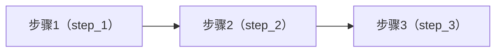

import { Aside, Tabs, TabItem } from "@astrojs/starlight/components"

输出规范允许你把**某个步骤的输出**映射成工作流对外发布的**稳定输出**。

## 输出规范结构

输出规范使用 JSON 格式定义：

```json
{
  "version": 1,         /* 版本号目前固定为 1 */
  "outputs": {
    "summary": {        /* 对外输出名 */
      "stepKey": "summarize",
      "field": "text",  /* 可选：只取 outputs.text */
      "title": "摘要",
      "description": "用于展示的摘要文本"
    }
  }
}
```

### `version`

当前版本号，固定为 `1`。

### `outputs`

输出映射表：key 是**对外输出名**，value 是映射配置对象。

每个输出支持字段：

- `stepKey` - 来源步骤 key（必需）
- `field` - 只取步骤输出中的某个字段（可选）
- `title` - UI 展示标题（可选）
- `description` - UI 说明（可选）

## 映射规则

### 输出来源

输出规范读取的是步骤 `main(env, ctx)` 的返回值中的 `outputs`：

```javascript
return { outputs: { text: "hello", wordCount: 5 } };
```

### 设置 `field`

输出值为该步骤的整个 `outputs` 对象。

### 未设置 `field`

输出值就是步骤的整个 `outputs[field]` 对象。

<Aside type="note" title="什么时候是 null">
如果来源步骤没有成功执行，或者 `field` 指向的字段不存在，对应输出值为 `null`。输出规范本身不会因此失效。
</Aside>

## 示例

有这样一个工作流，结构如下：



步骤脚本：

<Tabs>
<TabItem label="步骤 1">
```js
export default {
  async main(env, ctx) {
    return {
      outputs: {
        items: ["a", "b", "c"],
        count: 3,
        source: "demo",
      },
    }
  },
}
```
</TabItem>
<TabItem label="步骤 2">
```js
export default {
  async main(env, ctx) {
    const s1 = ctx.upstream["step_1"]?.data?.outputs ?? null
    if (!s1) throw new Error("Missing upstream outputs: step_1")

    return {
      outputs: {
        itemsUpper: (s1.items ?? []).map((x) => String(x).toUpperCase()),
        count: Number(s1.count ?? 0),
        summary: `count=${Number(s1.count ?? 0)}`,
      },
    }
  },
}
```
</TabItem>
<TabItem label="步骤 3">
```js
export default {
  async main(env, ctx) {
    const s2 = ctx.upstream["step_2"]?.data?.outputs ?? null
    if (!s2) throw new Error("Missing upstream outputs: step_2")

    return {
      outputs: {
        status: "ok",
        text: `items=${JSON.stringify(s2.itemsUpper ?? [])}`,
        itemCount: Number(s2.count ?? 0),
      },
    }
  },
}
```
</TabItem>
</Tabs>

### 1. 输出所有步骤的所有属性

```json
{
  "version": 1,
  "outputs": {
    "step1": { "stepKey": "step_1" },
    "step2": { "stepKey": "step_2" },
    "step3": { "stepKey": "step_3" }
  }
}
```

### 2. 输出步骤 1、2 的 所有属性 + 步骤 3 的部分属性

```json
{
  "version": 1,
  "outputs": {
    "step1": { "stepKey": "step_1" },
    "step2": { "stepKey": "step_2" },
    "status": { "stepKey": "step_3", "field": "status" },
    "text": { "stepKey": "step_3", "field": "text" }
  }
}
```

### 3. 输出步骤 1、2、3 的部分属性

```json
{
  "version": 1,
  "outputs": {
    "items": { "stepKey": "step_1", "field": "items" },
    "count": { "stepKey": "step_1", "field": "count" },
    "summary": { "stepKey": "step_2", "field": "summary" },
    "status": { "stepKey": "step_3", "field": "status" },
    "itemCount": { "stepKey": "step_3", "field": "itemCount" }
  }
}
```

<Aside type="note" title="说明">
聚合时会读取来源步骤的最新成功输出；当步骤未成功执行或字段不存在时，对应输出值为 `null`。
</Aside>
