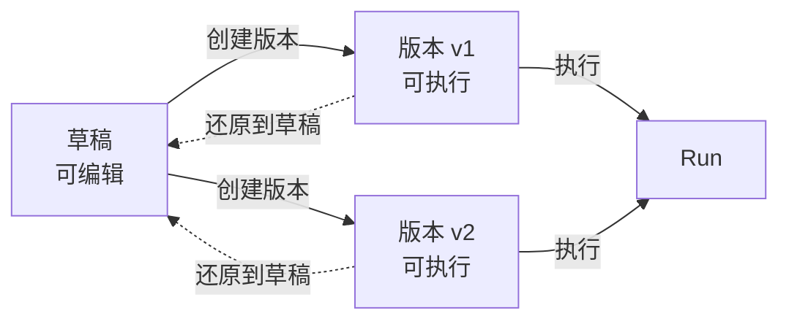

import { Aside } from "@astrojs/starlight/components"

版本是工作流的**不可变副本**，具体运行的时候，将使用固定的版本运行。还原是将某个版本的内容覆盖回草稿，以恢复到已知稳定状态。

- **草稿**：工作流的可编辑状态（代码、依赖、环境变量、输入输出规范）。
- **版本**：一次发布的结果（不可修改，可用于执行）。
- **还原**：将某个版本恢复到草稿，用于继续编辑。

## 创建版本

版本有两种创建方式：

- **手动创建**：在工作流详情页右上角点击`创建版本`来创建。
- **半自动创建**：在`新建任务`、`新建/编辑调度`、`新建批次`时，如果选择了草稿，系统会自动基于此草稿创建新版本。

## 版本保证项

同一个版本在执行时会保持一致：

- **步骤代码**
- **依赖**
- **环境变量**
- **输入规范与输出规范**

<Aside type="tip" title="理解方式">
版本用于固化**本次执行使用的完整配置**。对草稿的修改不会影响已创建的版本。
</Aside>

## 不保证项

版本保证的是**工作流配置不变**，无法保证外部环境不变，例如：

- 外部 API 返回
- 网络与超时
- 时间、随机数
- 并发与资源波动

## 还原到草稿

还原适用于以下场景：将草稿恢复到稳定版本；或以某个历史版本为起点继续开发。

1. 在版本列表里选一个版本
2. 点“还原到草稿”
3. 草稿会被该版本完全覆盖

<Aside type="caution" title="会覆盖草稿">
还原会覆盖当前草稿。如需保留草稿中的变更，建议先创建版本后再还原。
</Aside>

## 示例

在草稿中调整依赖与环境变量并验证通过后，创建 `v3`。如线上发现问题，可将执行方切回 `v2`，同时将 `v2` 还原到草稿进行修复；修复完成后再创建 `v4`。该流程可实现执行与开发互不影响。
